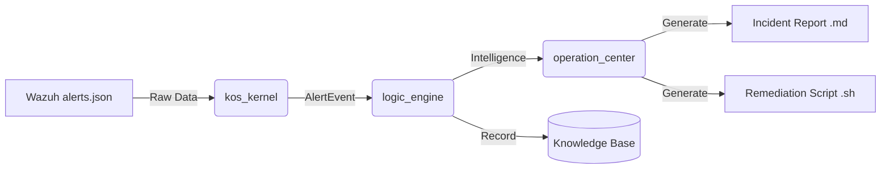

# Knowledge-oriented-Security-Framework
## Hệ thống Phân tích Bảo mật Thông minh cho SMB (Tích hợp Wazuh SIEM)

KOS là một hệ thống tinh gọn, được thiết kế để hỗ trợ các doanh nghiệp vừa và nhỏ (SMB) quy trình phân tích và ứng phó sự cố bảo mật từ log của Wazuh.

### 🚀 Tính năng chính
- **Perception Layer:** Giám sát real-time file `alerts.json` của Wazuh.
- **Logic Engine:** Phân tầng nguy cơ (Layer A-E) và chấm điểm uy tín IP (IP Reputation).
- **Operation Center:** Tự động sinh báo cáo sự cố (.md) và kịch bản chặn IP (.sh).
- **Knowledge Base:** Lưu trữ tri thức tấn công để đối soát lâu dài.

### 🛠 Kiến trúc hệ thống
Hệ thống gồm 3 tầng xử lý chính:
1. **Perception (Cảm nhận):** Thu thập dữ liệu thô.
2. **Logic (Tư duy):** Phân tích và đánh giá mức độ nguy hiểm.
3. **Operation (Vận hành):** Đề xuất kịch bản ứng phó.

### 📖 Hướng dẫn sử dụng
1. Cài đặt thư viện: `pip install watchdog`
2. Chạy hệ thống với quyền quản trị: `sudo python3 main.py`
3. Xem báo cáo tổng hợp: `python3 main.py --knowledge-report`

---

# 🔐 Knowledge-oriented Security Framework (KOS)

## 📖 Giới thiệu
Dự án **KOS** (Knowledge Operating System) là một khung bảo mật định hướng tri thức, được thiết kế dựa trên mô hình **CIA** (Confidentiality – Integrity – Availability).  
Hệ thống mô phỏng quá trình xử lý thông tin của một thực thể thông minh: **Cảm nhận → Tư duy → Hành động**, nhằm phát hiện, phân tích và phản ứng tự động trước các mối đe dọa an ninh mạng.

---

## 🏗️ Kiến trúc hệ thống
KOS được xây dựng theo mô hình **3 tầng**:

1. **Perception Layer (kos_kernel.py)**  
   - Giám sát real-time file `alerts.json` từ Wazuh SIEM.  
   - Chuẩn hóa dữ liệu JSON thành đối tượng `AlertEvent`.  
   - Quét ngược dữ liệu cũ khi khởi động để không bỏ sót tấn công.

2. **Logic Analysis Layer (logic_engine.py)**  
   - Phân loại sự kiện theo mức độ nghiêm trọng (Layer A–E).  
   - Chấm điểm uy tín IP qua `reputation_db.json`.  
   - Nhận diện loại tấn công qua bộ lọc từ khóa.

3. **Operation Layer (operation_center.py)**  
   - Gom nhóm sự kiện thành Incident duy nhất.  
   - Sinh báo cáo tự động dưới dạng Markdown.  
   - Sinh script Bash (`.sh`) để chặn IP tấn công.  
   - Tự động chốt báo cáo sau khoảng thời gian yên tĩnh.

📌 Chi tiết kiến trúc nằm trong file `[Có vẻ như kết quả này không an toàn để hiển thị. Hãy thay đổi một chút và thử lại!]`.

---

## 🔄 Luồng dữ liệu


---

## 🧠 Kho tri thức (Knowledge Base)
KOS duy trì một **Knowledge Base** để lưu trữ tri thức lâu dài, giúp hệ thống có “trí nhớ dài hạn” về các thực thể tấn công, hỗ trợ **forensics** và đối soát sau sự cố.

---

## 🔐 Liên hệ với mô hình CIA
- **Confidentiality:** Chỉ module hợp lệ mới truy cập dữ liệu cảnh báo.  
- **Integrity:** AlertEvent được xác thực bằng checksum để tránh giả mạo.  
- **Availability:** Operation Layer đảm bảo hệ thống luôn phản ứng liên tục.

---

## 🛠️ Công nghệ sử dụng
- Python 3.11  
- Watchdog (giám sát file)  
- Pandas (phân tích dữ liệu)  
- Matplotlib (biểu đồ báo cáo)  
- Markdown (tài liệu báo cáo)  

---

## 🚀 Cách cài đặt
```bash
git clone https://github.com/100048777766367/Knowledge-oriented-Security-Framework.git
cd Knowledge-oriented-Security-Framework
pip install -r requirements.txt
```

---

## ▶️ Chạy demo
```bash
python src/main.py
```

---

## 📜 Giấy phép
Dự án phát hành theo giấy phép **MIT License**. Xem chi tiết trong file `[Có vẻ như kết quả này không an toàn để hiển thị. Hãy thay đổi một chút và thử lại!]`.

---
