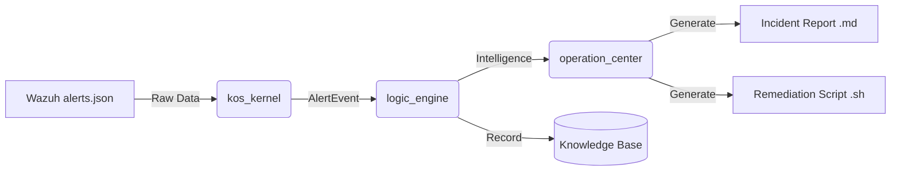

# 🏗️ KOS System Architecture (Kiến trúc Hệ thống KOS)

Hệ thống KOS (Knowledge-oriented Security Framework) được xây dựng dựa trên triết lý **Separation of Concerns**, mô phỏng quá trình xử lý thông tin của một thực thể thông minh: **Cảm nhận → Tư duy → Hành động**.

---

## 1. Tầng Cảm nhận (Perception Layer)
- **Module:** `kos_kernel.py`  
- **Vai trò:** Là “giác quan” của hệ thống, kết nối với môi trường bên ngoài (Wazuh SIEM).  
- **Chức năng chính:**
  - **Real-time Monitoring:** Giám sát file `alerts.json` của Wazuh theo chu kỳ 0.1s.  
  - **Data Normalization:** Chuẩn hóa dữ liệu JSON phức tạp thành đối tượng `AlertEvent`.  
  - **Back-scanning:** Quét ngược dữ liệu cũ khi khởi động để không bỏ sót tấn công.

---

## 2. Tầng Tư duy (Logic Analysis Layer)
- **Module:** `logic_engine.py`  
- **Vai trò:** Là “bộ não”, phân tích dữ liệu thô để tạo tri thức có giá trị.  
- **Chức năng chính:**
  - **Risk Layering:** Phân loại sự kiện thành 5 tầng A–E theo mức độ nghiêm trọng.  
  - **IP Reputation Scoring:** Duy trì cơ sở dữ liệu `reputation_db.json`, trừ điểm IP xấu, gắn nhãn BLOCKED khi <30 điểm.  
  - **Threat Classification:** Nhận diện loại tấn công qua bộ lọc từ khóa (Brute Force, Malware, Policy Violation).

---

## 3. Tầng Vận hành (Operation Layer)
- **Module:** `operation_center.py`  
- **Vai trò:** Là “đôi tay”, thực hiện phản ứng thực tế để bảo vệ hệ thống.  
- **Chức năng chính:**
  - **Incident Aggregation:** Gom nhóm sự kiện thành một Incident duy nhất.  
  - **Automated Reporting:** Sinh báo cáo Markdown với thống kê và timeline.  
  - **Remediation Scripting:** Sinh script Bash (`.sh`) chứa lệnh iptables/ufw để chặn IP tấn công.  
  - **Auto-Flush:** Tự động chốt báo cáo sau 10s không có tấn công mới.

---

## 🔄 Luồng dữ liệu (Data Pipeline)

---

## 🧠 Kho tri thức (Knowledge Base)
Ngoài 3 tầng xử lý, KOS duy trì một **Knowledge Base** để lưu trữ tri thức lâu dài. Mỗi node tri thức giúp hệ thống có “trí nhớ dài hạn” về các thực thể tấn công, hỗ trợ **forensics** và đối soát sau sự cố.

---

## 🔐 Liên hệ với mô hình CIA
- **Confidentiality:** Chỉ module hợp lệ mới truy cập dữ liệu cảnh báo.  
- **Integrity:** AlertEvent được xác thực bằng checksum để tránh giả mạo.  
- **Availability:** Operation Layer đảm bảo hệ thống luôn phản ứng liên tục, kể cả khi chịu tải cao.

---

## 🛠️ Công nghệ sử dụng
- Python 3.11  
- Watchdog (giám sát file)  
- Pandas (phân tích dữ liệu)  
- Matplotlib (biểu đồ báo cáo)  
- Markdown (tài liệu báo cáo)  

---

